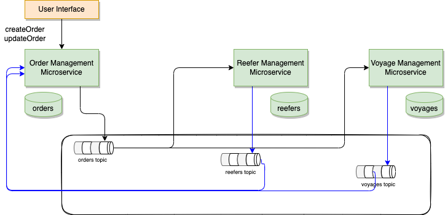

# Saga Choreography demonstration

## Context

Introduced in 1987 [by Hector Garcaa-Molrna Kenneth Salem paper](https://www.cs.cornell.edu/andru/cs711/2002fa/reading/sagas.pdf) the Saga pattern helps to support a long running transaction that can be broken up to a collection of sub transactions that can be interleaved any way with other transactions.

With microservice each transaction updates data within a single service, each subsequent steps may be triggered by previous completion. 

## Implementation explanation

We have implemented the SAGA pattern in the Reefer Container Shipment Reference Application for the scenario where an order, to carry fresh goods from an origin port to a destination port, is created by a customer. The Choreography variant of the SAGA pattern, done with Kafka, involves strong decoupling between services, and each participants listen to facts and act on them independently. So each service will have at least one topic representing states on their own entity. In the figure below the saga is managed in the context of the order microservice in one of the business function like `createOrder`.



The figure above illustrates that each services uses its own topic in Kafka, so to manage the saga the Order service needs to listen to all participants outcome.

The happy path looks like in the following sequence diagram:


In this scenario, we have a long running transaction that spans across the Order Command microservice that creates the order and maintains the state of it, to the Reefer manager microservice that will try to find an empty container with enough capacity in the origin port to support the order, to the Voyage microservice that will try to find a voyage from the origin port to the destination port with enough capacity on the ship for the refrigerator containers.

As you can see in the diagram above, the transaction does not finish until a reefer has been allocated and a voyage assigned to the order and, as a result, the order stays in pending state until all the sub transactions have successfully finished.

### Code repositories

The new implementation of the services are done with Quarkus and Microprofile Messaging.

* [Order Microservice](https://github.com/ibm-cloud-architecture/refarch-kc-order-cmd-ms)
* [Reefer Microsercice](https://github.com/ibm-cloud-architecture/refarch-kc-reefer-ms)
* [Voyage Microservice](https://github.com/ibm-cloud-architecture/refarch-kc-voyage-ms)

Each code structure is based on the domain-driven-design practice with clear separation between layer and keep the domain layer using the ubiquituous language of each domain: order, reefer, and voyage.

### Compensation

The SAGA pattern comes with the tradeoff that a compensation process must also be implemented in the case that one, or multiple, of the sub transactions fails or does not achieve to complete so that the system rolls back to the initial state before the transaction began.

In our specific case, a new order creation transaction can fail either because we can not find a refrigerator container to be allocated to the order or we can not find a voyage to assigned to the order.

### No container


When a new order creation is requested by a customer but there is not a container to be allocated to such order, either because the container(s) do not have enough capacity or there is no container available in the origin port for such order, the compensation process for the order creation transaction is quite simple. The order microservice will not get an answer 

The Spring Container microservice will emit a ContainerNotFound event that will inform the interested parties (Order Command and Voyages) that there is no container available for a particular order creation request. The Voyages microservices will not need to do anything while the Order Command microservice will transition the order creation request to rejected as a result. It will also emit an OrderRejected event to inform any other interested parties.

### No voyage


This case is, however, a bit more complicate than the previous one as, this time, the Spring Container microservice will have to compensate for the action of allocating a container to the order. As we see, the actions flow remains as expected for the SAGA transaction until the Voyages microservice informs with a VoyageNotFound event that there is no voyage matching the required request of the order. As a result, the Order Command microservice will transition the order to Rejected and emit an OrderRejected event to inform the interested parties. In this case, the Spring Container is one of those interested parties as it will need to kick off the compensation process, which in this case is nothing more than de-allocate the container to the order to make it available for any other coming order.

## Run locally

In this repository, we have define a docker compose file that let you run the demonstration on your local computer. You need podman or docker and docker compose.

```sh
docker-compose up -d
```

### Happy path demonstration

Execute the create order

```sh
./e2e/scripts/createOrder.sh
```

## Deploy with Event Streams on OpenShift

