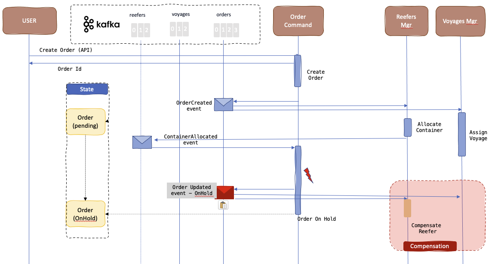

# Saga Choreography demonstration

## Context

Introduced in 1987 [by Hector Garcaa-Molrna Kenneth Salem paper](https://www.cs.cornell.edu/andru/cs711/2002fa/reading/sagas.pdf) the Saga pattern helps to support a long running transaction that can be broken up to a collection of sub transactions that can be interleaved any way with other transactions.

With microservice each transaction updates data within a single service, each subsequent steps may be triggered by previous completion. 

## Implementation explanation

We have implemented the SAGA pattern in the Reefer Container Shipment Reference Application for the scenario where an order, to carry fresh goods from an origin port to a destination port, is created by a customer. The Choreography variant of the SAGA pattern, done with Kafka, involves strong decoupling between services, and each participant listens to facts from other services and acts on them independently. So each service will have at least one topic representing states on its own entity. In the figure below the saga is managed in the context of the order microservice in one of the business function like `createOrder`.

{ width="900" }

The figure above illustrates that each service uses its own topic in Kafka to generate event about state changes to its own business entity. 

To manage the saga the `Order service` needs to listen to all participants topics and correlates event using the order ID as key.

The Order business entity in this service supports a simple state machine as defined below:


Each state transition should generate an event to the orders topic.

The happy path looks like in the following sequence diagram:


In this scenario, we have a long running transaction that spans across the Order Command microservice that creates the order and maintains the state of it, the Reefer manager microservice which tries to find an empty container with enough capacity in the origin port to support the order, the Voyage microservice which tries to find a voyage from the origin port to the destination port with enough capacity on the ship for the refrigerator containers.

As you can see in the diagram above, the transaction does not finish until a reefer has been allocated and a voyage assigned to the order and, as a result, the order stays in pending state until all the sub transactions have successfully finished.

### Code repositories

The new implementation of the services are done with Quarkus and Microprofile Messaging.

* [Order Microservice](https://github.com/ibm-cloud-architecture/refarch-kc-order-cmd-ms)
* [Reefer Microsercice](https://github.com/ibm-cloud-architecture/refarch-kc-reefer-ms)
* [Voyage Microservice](https://github.com/ibm-cloud-architecture/refarch-kc-voyage-ms)

Each code structure is based on the domain-driven-design practice with clear separation between layers (app, domain, infrastructure) and keep the domain layer using the ubiquituous language of each domain: order, reefer, and voyage.

```
│   │   │   └── ibm
│   │   │       └── eda
│   │   │           └── kc
│   │   │               └── orderms
│   │   │                   ├── app
│   │   │                   │   └── OrderCommandApplication.java
│   │   │                   ├── domain
│   │   │                   │   ├── Address.java
│   │   │                   │   ├── OrderService.java
│   │   │                   │   └── ShippingOrder.java
│   │   │                   └── infra
│   │   │                       ├── api
│   │   │                       │   └── ShippingOrderResource.java
│   │   │                       ├── events
│   │   │                       │   ├── EventBase.java
│   │   │                       │   ├── order
│   │   │                       │   │   ├── OrderCreatedEvent.java
│   │   │                       │   │   ├── OrderEvent.java
│   │   │                       │   │   ├── OrderEventProducer.java
│   │   │                       │   │   ├── OrderUpdatedEvent.java
│   │   │                       │   │   └── OrderVariablePayload.java
│   │   │                       │   ├── reefer
│   │   │                       │   │   ├── ReeferAgent.java
│   │   │                       │   │   ├── ReeferAllocated.java
│   │   │                       │   │   ├── ReeferEvent.java
│   │   │                       │   │   ├── ReeferEventDeserializer.java
│   │   │                       │   │   └── ReeferVariablePayload.java
│   │   │                       │   └── voyage
│   │   │                       │       ├── VoyageAgent.java
│   │   │                       │       ├── VoyageAllocated.java
│   │   │                       │       ├── VoyageEvent.java
│   │   │                       │       ├── VoyageEventDeserializer.java
│   │   │                       │       └── VoyageVariablePayload.java
│   │   │                       └── repo
│   │   │                           ├── OrderRepository.java
│   │   │                           └── OrderRepositoryMem.java
```

Events are defined in the infrastructure level, as well as the JAX-RS APIs.
### Compensation

The SAGA pattern comes with the tradeoff that a compensation process must also be implemented in the case that one, or multiple, of the sub transactions fails or does not achieve to complete so that the system rolls back to the initial state before the transaction began.

In our specific case, a new order creation transaction can fail either because we can not find a refrigerator container to be allocated to the order or we can not find a voyage to assigned to the order.

### No container


When a new order creation is requested by a customer but there is not a container to be allocated to such order, either because the container(s) do not have enough capacity or there is no container available in the origin port for such order, the compensation process for the order creation transaction is quite simple. The order microservice will not get an answer from the reefer manager, anf after a certain time it will trigger the compensation flow by sending a OrderUpdate with status onHold. The voyage service which may has responded positively before that, may roll back the order to voyage relationship.

### No voyage



This case is the sysmetric of the other one. The actions flow remains as expected for the SAGA transaction until the Voyages microservice is not answering after a time period or answering negatively. As a result, the Order Command microservice will transition the order to `OnHold` and emit an OrderUpdateEvent to inform the saga participants. In this case, the Reefer manager is one of those interested parties as it will need to kick off the compensation task, which in this case is nothing more than de-allocate the container to the order to make it available for any other coming order.

## Run locally

In this repository, we have define a docker compose file that let you run the demonstration on your local computer. You need podman or docker and docker compose.

```sh
docker-compose up -d
```

### Verify the data

* Look available voyages, can be seen via API or Swagger UI [https://localhost:8082/q/swagger-ui](https://localhost:8082/q/swagger-ui)

```sh
curl -X 'GET' 'http://localhost:8082/api/v1/voyages' -H 'accept: application/json' | jq
```

* Look available Refrigerator containers, can be seen via API or Swagger UI [https://localhost:8081/q/swagger-ui](https://localhost:8081/q/swagger-ui)

```sh
curl -X 'GET' 'http://localhost:8081/api/v1/reefers' -H 'accept: application/json' | jq
```

* Validate Order service by looking at current orders via API or Swagger UI [https://localhost:8080/q/swagger-ui](https://localhost:8080/q/swagger-ui)

```sh
curl -X 'GET' 'http://localhost:8080/api/v1/orders' -H 'accept: application/json' | jq
```

### Happy path demonstration

* Execute the create order

```sh
./e2e/sendGoodOrder.sh
```

```json
{ "orderID": "GoodOrder02",
  "productID":"P01",
  "customerID":"Customer01",
  "quantity":70,
  "pickupAddress":{"street":"1st main street","city":"San Francisco","country":"USA","state":"CA","zipcode":"95051"},
  "pickupDate":null,
  "destinationAddress":{"street":"1st horizon road","city":"Shanghai","country":"CH","state":"S1","zipcode":"95051"},
  "expectedDeliveryDate":null,
  "creationDate":"2022-05-16",
  "updateDate":"2022-05-16",
  "status":"pending"}
```

* Verify in Kafdrop the `orders` topic contains the expected CreateOrder event

```sh
chrome https://localhost:9000
```


* Verify in Kafdrop the `reefers` topic


* Verify the `voyages` topic


* The ShippingOrder should now be in assigned state as the order manager receives the two positive answers from the saga participant.


### Trigger the compensation tasks

The order has a pickup city set to Boston, and there is no reefer available at that location at that time, so the Reefer service is not responding to the order. The order microservice has two timers for each topics it subscribes to. If those timer sets, it looks at existing pending orders and trigget an OrderUpdateEvent with status onHold.

* Send an order from Boston

    ```sh
    ./e2e/sendNonPossibleOrder.sh
    ```

    

* Verify order created event reaches voyage service:

    ```logs
    09:45:06 INFO  [ib.ed.kc.vo.in.ev.or.OrderAgent] (vert.x-eventloop-thread-5) Received order : NAOrder01
    09:45:06 INFO  [ib.ed.kc.vo.in.ev.vo.VoyageEventProducer] (vert.x-eventloop-thread-5) Send voyage message --> V005 ts: 1652805906035
    ```

* and the reefer microservices

    ```logs
    09:45:05 INFO  [ib.ed.kc.fr.in.ev.or.OrderAgent] (vert.x-eventloop-thread-6) Received order : NAOrder01
    ```

* Voyage generates an event for voyages allocated.

* Order microservice timeout as it does not get an answer from Reefer, so it put the order on-Hold and send an order updated event

    

* Voyage is compensated.


## Deploy with Event Streams on OpenShift

Deploy the three services with an existing Event Streams deployed in the namespace `cp4i-eventstreams`.
### One time deploy

* Under `gitops` folder do the following

```sh
make all
```

You should get a trace like:

```sh
namespace/eda-saga created
serviceaccount/eda-saga-sa created
role.rbac.authorization.k8s.io/secret-mgr created
rolebinding.rbac.authorization.k8s.io/argocd-admin created
clusterrolebinding.rbac.authorization.k8s.io/secrets-to-sa configured
Now using project "eda-saga" on server "https://api.poe.coc-ibm.com:6443".
job.batch/cp-ca-secret created
job.batch/cp-tls-usr-secret created
kafkatopic.eventstreams.ibm.com/eda-saga-orders created
kafkatopic.eventstreams.ibm.com/eda-saga-reefers created
kafkatopic.eventstreams.ibm.com/eda-saga-voyages created
kafkauser.eventstreams.ibm.com/saga-tls-user created
serviceaccount/eda-saga-sa configured
rolebinding.rbac.authorization.k8s.io/eda-saga-view created
configmap/order-ms-cm created
service/eda-saga-order created
deployment.apps/eda-saga-order created
route.route.openshift.io/eda-saga-order created
configmap/reefer-ms-cm created
service/eda-saga-reefer created
deployment.apps/eda-saga-reefer created
route.route.openshift.io/eda-saga-reefer created
configmap/voyage-ms-cm created
service/eda-saga-voyage created
deployment.apps/eda-saga-voyage created
route.route.openshift.io/eda-saga-voyage created
```

* Open order Swagger-ui

```sh
chrome http://$(oc get route eda-saga-order -o jsonpath='{.status.ingress[].host}')/q/swagger-ui/
```

* Post a valid order using the e2e script. Run the following command in `e2e/poe` folder

```sh
export ORDER_URL=$(oc get route eda-saga-order -o jsonpath='{.status.ingress[].host}')
./sendGoodOrder.sh 

{"orderID":"GoodOrder01","productID":"P01","customerID":"Customer01","quantity":10,"pickupAddress":{"street":"1st main street","city":"San Francisco","country":"USA","state":"CA","zipcode":"95051"},"pickupDate":null,"destinationAddress":{"street":"1st horizon road","city":"Shanghai","country":"CH","state":"S1","zipcode":"95051"},"expectedDeliveryDate":null,"creationDate":"2022-06-08","updateDate":"2022-06-08","status":"pending","voyageID":null,"containerID":null}
```

* To clean up

```sh
make clean
```

### GitOps with ArgoCD/Tekton

TBD

???- "More reading"
    * [Deduction-Based Polymorphism in Jackson 2.12](https://www.baeldung.com/jackson-deduction-based-polymorphism)
    * [Smallrye - reactive messaging](https://smallrye.io/smallrye-reactive-messaging/3.14.1/)
    * [Saga design pattern](https://ibm-cloud-architecture.github.io/refarch-eda/patterns/saga/)
    * [Quarkus Kafka reference guide](https://quarkus.io/guides/kafka#testing-without-a-broker)
    * [Quarkus SCHEDULING PERIODIC TASKS](https://quarkus.io/guides/scheduler#standard-scheduling)